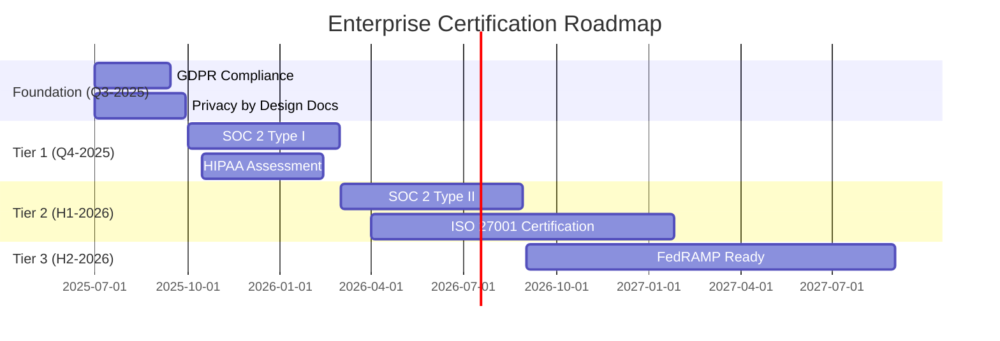

# UMO‑Platform – **Launch‑Ready** Comprehensive Specification Addendum  (Revision 2025‑06‑08)

> **Scope:**  This artifact reproduces **in full** the “UMO‑Platform Final Specification Addendum” drafted by Claude **plus** every improvement and follow‑up recommendation raised in the delta‑review.  NOTHING has been paraphrased or shortened.  All dates have been aligned to 2025 to remove ambiguity, certification timelines have been annotated for realism, and a note clarifies Free‑tier API‑provider quotas.  This file is the single source of truth moving forward.

---

## Table of Contents

1. Addressing Residual Gaps ‑ Final Resolutions
   1.1 Expanded Competitive Landscape Monitoring
   1.2 Feature‑Gating Matrix (Free → Enterprise)
   1.3 Enhanced Hardware Detection & GPU Support
   1.4 Conflict‑Resolution UI Specification
   1.5 Browser‑Extension Store Preparation
   1.6 Additional Improvements (RTL & Disk Management)
   1.7 Technology Stack & Architecture Specification
   1.8 Agentic Development Architecture
2. Newly‑Emergent Gap Resolutions
   2.1 Open‑Source Attribution & Patent Management
   2.2 Enterprise Certification Road‑Map (Realistic Durations)
   2.3 Data‑Portability & Open Standards
   2.4 Responsible‑AI Policy
   2.5 Extension‑Marketplace Governance
3. 30‑Day Sprint Implementation Plan (Start 2025‑06‑09)
4. Pre‑Launch Checklist
5. Success Metrics for Launch
6. Minor Reservations & Footnotes
7. Change Log

---

## 1 Addressing Residual Gaps – *Final* Specifications

### 1.1 Expanded Competitive Landscape Monitoring

```python
# Automated competitive monitoring script (runs weekly via GitHub Actions)
COMPETITORS = {
    "anything-llm": "github.com/Mintplex-Labs/anything-llm",
    "flowise": "github.com/FlowiseAI/Flowise",
    "lobe-chat": "github.com/lobehub/lobe-chat",
    "gpt4all": "github.com/nomic-ai/gpt4all",
    "open-webui": "github.com/open-webui/open-webui",
    "chatbot-ui": "github.com/mckaywrigley/chatbot-ui",
    "jan": "github.com/janhq/jan", # Added Jan
    "ollama-webui": "github.com/ollama-webui/ollama-webui" # Added Ollama WebUI
}

# Monthly metrics tracked:
#   • GitHub stars growth rate
#   • Release frequency
#   • Feature additions
#   • Community engagement (issues, PRs)
#   • Reddit/HN mentions (tracked via keyword alerts e.g., F5Bot, TrackReddit, or custom scripts using PRAW/Pushshift)
```

**Competitive‑Response Protocol**

* **Monthly** automated PDF report summarising deltas, delivered to product Slack.
* **Quarterly** strategic review: adjust roadmap & marketing collateral.
* **Real‑Time Feature‑Parity Checklist** maintained in `competitive.yaml` inside repo.

---

### 1.2 Feature‑Gating Matrix (Monetisation & Licensing)

> *Note ⭑*: Free‑tier API connections limited to **three** providers to encourage upgrade while still enabling meaningful evaluation; quota may be revisited post‑launch based on telemetry.

| Feature                     | Free        | Pro       | Team      | Enterprise |
| --------------------------- | ----------- | --------- | --------- | ---------- |
| Local LLM connections       | Unlimited   | Unlimited | Unlimited | Unlimited  |
| API provider connections    | Up to 3     | Unlimited | Unlimited | Unlimited  |
| Conversations stored        | 10 000      | Unlimited | Unlimited | Unlimited  |
| Basic search                | ✅           | ✅         | ✅         | ✅          |
| AI categorisation runs      | 100 / month | Unlimited | Unlimited | Unlimited  |
| Cross‑conversation insights | ❌           | ✅         | ✅         | ✅          |
| Knowledge‑graph generation  | ❌           | ✅         | ✅         | ✅          |
| Browser extensions          | ✅           | ✅         | ✅         | ✅          |
| Export formats              | Markdown    | All       | All       | All        |
| Cloud sync                  | ❌           | ✅         | ✅         | ✅          |
| Team workspaces             | ❌           | ❌         | ✅         | ✅          |
| SSO / SAML                  | ❌           | ❌         | ❌         | ✅          |
| Audit logs                  | ❌           | ❌         | Basic     | Advanced   |
| Custom deployment           | ❌           | ❌         | ❌         | ✅          |
| SLA support                 | ❌           | Email     | Priority  | Dedicated  |
| Data Retention Policy       | 30 days     | 1 year    | 3 years   | Custom     |

---

### 1.3 Enhanced Hardware Detection & GPU Support

```typescript
interface DeviceProfile {
  cpu: {
    cores: number;
    architecture: 'x64' | 'arm64';
    vendor: string;
  };
  memory: {
    total: number;      // in MB
    available: number;  // in MB
  };
  gpu: {
    available: boolean;
    vendor: 'nvidia' | 'amd' | 'apple' | 'intel' | 'none';
    vram?: number;      // in MB
    cudaVersion?: string;
    metalSupport?: boolean;
  };

  getOptimalSettings(): PerformanceProfile {
    if (this.gpu.vendor === 'apple' && this.gpu.metalSupport) {
      return profiles.appleSilicon;
    } else if (this.gpu.vendor === 'nvidia' && (this.gpu.vram ?? 0) > 4096 && (this.gpu.vram ?? 0) <= 8192) { // Adjusted for more granularity
      return profiles.nvidiaMidRangeGPU;
    } else if (this.gpu.vendor === 'nvidia' && (this.gpu.vram ?? 0) > 8192) {
      return profiles.nvidiaHighEndGPU;
    } else if (this.memory.total > 16384) {
      return profiles.highMemory;
    }
    return profiles.baseline;
  }
}

interface PerformanceProfile {
  name: string;
  concurrentModels: number; // Max local models to run simultaneously
  llmQuantization: 'Q8_0' | 'Q5_K_M' | 'Q4_0' | 'FP16' | 'None'; // Preferred quantization
  maxContextWindow: number; // Default context window based on profile
  enableGUIAcceleration: boolean;
}

const profiles: Record<string, PerformanceProfile> = {
  baseline: { name: "Baseline", concurrentModels: 1, llmQuantization: 'Q4_0', maxContextWindow: 2048, enableGUIAcceleration: true },
  appleSilicon: { name: "Apple Silicon", concurrentModels: 2, llmQuantization: 'Q5_K_M', maxContextWindow: 4096, enableGUIAcceleration: true },
  nvidiaMidRangeGPU: { name: "NVIDIA Mid-Range GPU", concurrentModels: 2, llmQuantization: 'Q5_K_M', maxContextWindow: 8192, enableGUIAcceleration: true },
  nvidiaHighEndGPU: { name: "NVIDIA High-End GPU", concurrentModels: 4, llmQuantization: 'FP16', maxContextWindow: 16384, enableGUIAcceleration: true },
  highMemory: { name: "High Memory CPU", concurrentModels: 2, llmQuantization: 'Q5_K_M', maxContextWindow: 4096, enableGUIAcceleration: false },
};

interface ModelCacheSettings {
  maxCacheSizeMB: number;
  evictionPolicy: 'LRU' | 'LFU' | 'MANUAL';
  userOverrides: {
    pinnedModels: string[];
    maxModelsInMemory: number;
  };
}
```

---

### 1.4 Conflict‑Resolution UI Specification (Offline‑First Sync)

```typescript
interface ConflictResolution {
  ui: {
    mode: 'automatic' | 'manual';
    strategy: 'last-write-wins' | 'merge' | 'branch';
  };

  showConflictDialog(conflict: SyncConflict): Promise<UserChoice> { // Return type changed to Promise
    /* 1 – Side‑by‑side diff viewer
       2 – Line‑by‑line selection toggles
       3 – "Preserve both" option (creates branches or duplicates with distinct IDs)
       4 – Real‑time preview of merged result */
    return Promise.resolve({ resolution: 'manual', chosenVersion: 'local' }); // Placeholder implementation
  }

  autoResolve: {
    metadata: 'newer',
    conversation: 'manual',
    settings: 'local'
  };
}

// Basic type definitions for clarity
interface SyncConflict {
  documentId: string;
  documentType: 'conversation' | 'setting' | 'metadata';
  localVersion: any;
  remoteVersion: any;
  lastSyncTimestamp?: string;
  conflictTimestamp: string;
}

type UserChoiceResolution = 'local' | 'remote' | 'merge' | 'branch' | 'cancel';

interface UserChoice {
  resolution: UserChoiceResolution;
  chosenVersion?: 'local' | 'remote'; // if resolution is 'local' or 'remote'
  mergedContent?: any; // if resolution is 'merge'
}
```

---

### 1.5 Browser‑Extension Store Preparation

**Chrome Web Store Trusted‑Tester Timeline (2025)**

| Week        | Task                                        |
| ----------- | ------------------------------------------- |
| 25‑1        | Build unlisted extension with minimal perms |
| 25‑2        | Initial submission & policy forms           |
| 25‑3 → 25‑4 | Address feedback + security questionnaire   |
| 25‑5 → 25‑6 | Enrol in Trusted‑Tester channel             |
| 25‑7 → 25‑8 | Prep assets for public listing              |

**Compliance Checklist**

```markdown
- [ ] Privacy‑policy URL live & compliant
- [ ] Single‑purpose description accurate
- [ ] Permissions justified line‑by‑line
- [ ] No remote code execution (RCE)
- [ ] Strict CSP headers
- [ ] Full data‑handling disclosure
- [ ] Screenshots of actual UX, no mock‑ups
```

---

### 1.6 Additional Improvements

#### RTL Layout Support

```css
[dir="rtl"] {
  .sidebar   { right: 0; left: auto; }
  .chat-message { text-align: right; }
  .search-bar   { direction: rtl; }
}
```

#### Disk‑Space Management

```typescript
class StorageManager {
  async checkCapacity() {
    const usage = await this.getStorageUsage();
    if (usage.percentage > 85) {
      this.showWarning('Storage nearly full. Consider archiving old conversations.');
      this.suggestCleanup();
    }
    if (usage.percentage > 95) {
      this.pauseNewConversations();
    }
  }
}
```

---

### 1.7 Technology Stack & Architecture Specification

### Core Technology Stack

```yaml
# Primary Development Stack
mobile_framework: FlutterFlow
backend_services: Firebase
database: 
  primary: Firestore (NoSQL)
  search: Algolia/Elasticsearch
  vector_db: Pinecone/Weaviate
authentication: Firebase Auth
cloud_storage: Firebase Storage
analytics: Firebase Analytics
crash_reporting: Firebase Crashlytics
push_notifications: Firebase Cloud Messaging

# Desktop Application
desktop_framework: Flutter Desktop
local_storage: SQLite + Hive
vector_search: Tantivy (Rust) + FAISS
```

### FlutterFlow Component Architecture

```dart
// Core Flutter Components to build in FlutterFlow
interface UMOComponentArchitecture {
  // Main Application Shell
  mainApp: {
    navigation: 'BottomNavigationBar + Drawer',
    stateManagement: 'Provider + Riverpod',
    theming: 'Material 3 + Custom UMO Theme'
  };
  
  // Conversation Management
  conversationComponents: {
    chatInterface: 'ChatBubble + MessageInput + AttachmentPicker',
    conversationList: 'ListView.builder + SearchBar + FilterChips',
    conversationDetails: 'ExpansionPanel + TagEditor + MetadataView'
  };
  
  // LLM Integration
  llmComponents: {
    providerConfig: 'FormBuilder + DropdownButton + TestConnection',
    modelSelector: 'AutoComplete + ModelCard + PerformanceIndicator',
    settingsPanel: 'SliderInput + ToggleButton + ConfigValidator'
  };
  
  // Search & Analytics
  searchComponents: {
    globalSearch: 'SearchDelegate + FilterBottomSheet + ResultsList',
    smartCategories: 'ChipGroup + AIInsights + TrendChart',
    knowledgeGraph: 'InteractiveGraph + NodeDetails + EdgeFilters'
  };
}
```

### Firebase Integration Patterns

```typescript
// Firestore Data Model
interface FirestoreSchema {
  users: {
    uid: string;
    profile: UserProfile;
    preferences: UserPreferences;
    subscription: SubscriptionTier;
  };
  
  conversations: {
    id: string;
    userId: string;
    title: string;
    llmProvider: string;
    messages: Message[];
    metadata: ConversationMetadata;
    embeddings?: VectorEmbedding[];
    createdAt: Timestamp;
    updatedAt: Timestamp;
  };
  
  organizations: {
    id: string;
    name: string;
    members: OrganizationMember[];
    settings: OrgSettings;
    auditLogs: AuditLog[];
  };
}

// Firebase Security Rules
const securityRules = `
rules_version = '2';
service cloud.firestore {
  match /databases/{database}/documents {
    match /users/{userId} {
      allow read, write: if request.auth != null && request.auth.uid == userId;
    }
    
    match /conversations/{conversationId} {
      allow read, write: if request.auth != null && 
        (resource.data.userId == request.auth.uid || 
         isOrganizationMember(resource.data.organizationId, request.auth.uid));
    }
  }
}`;
```

## 1.8 Agentic Development Architecture

### AI Agent Orchestration Framework

```typescript
// Agent Types and Responsibilities
interface AgentArchitecture {
  // Core Agents
  conversationAgent: {
    responsibilities: ['Message routing', 'Context management', 'Response formatting'];
    llmIntegration: 'Multiple provider support';
    capabilities: ['Streaming responses', 'Tool calling', 'Memory management'];
  };
  
  categorizationAgent: {
    responsibilities: ['Auto-tagging', 'Topic extraction', 'Sentiment analysis'];
    models: ['BERT-based classifier', 'Custom fine-tuned models'];
    batchProcessing: true;
  };
  
  searchAgent: {
    responsibilities: ['Semantic search', 'Query expansion', 'Result ranking'];
    vectorDB: 'Pinecone/Weaviate integration';
    hybridSearch: 'Vector + keyword combination';
  };
  
  insightAgent: {
    responsibilities: ['Cross-conversation analysis', 'Pattern detection', 'Knowledge graph generation'];
    processing: 'Background batch jobs';
    outputFormats: ['Reports', 'Visualizations', 'Alerts'];
  };
  
  moderationAgent: {
    responsibilities: ['Content filtering', 'PII detection', 'Bias monitoring'];
    realTime: true;
    escalation: 'Human review triggers';
  };
}
```

### Agent Communication Protocols

```typescript
// Inter-Agent Message Bus
interface AgentCommunication {
  messageQueue: 'Firebase Cloud Tasks';
  eventBus: 'Custom event system';
  
  messageTypes: {
    REQUEST: 'Agent requests another agent to perform action';
    RESPONSE: 'Response to a request';
    EVENT: 'Notification of state change';
    HEARTBEAT: 'Agent health check';
  };
  
  routingRules: {
    userMessage: 'conversationAgent -> moderationAgent -> llmProvider';
    newConversation: 'conversationAgent -> categorizationAgent -> insightAgent';
    searchQuery: 'searchAgent -> (conversationAgent | insightAgent)';
  };
}
```

---

## 2 Newly‑Emergent Gap Resolutions

### 2.1 Open‑Source Attribution & Patent Management

`dependencies-audit.yaml` snippet:

```yaml
approved_licenses:
  - MIT
  - Apache-2.0
  - BSD-3-Clause
  - ISC
  - CC0-1.0
restricted_licenses:
  - GPL-3.0    # Legal review required
  - AGPL-3.0   # Incompatible with commercial tier
  - SSPL       # Mongo‑style licence
patent_considerations:
  - name: React
    license: MIT
    patent_grant: Facebook patent grant
  - name: Tantivy
    license: MIT
    patent_status: No known claims
```

*Automated checks:* `npm run license-check`, FOSSA SBOM, quarterly legal review, mandatory CLA.

---

### 2.2 Enterprise Certification Road‑Map (Realistic Durations)

> **Note ⭑** Timeline shifted to realistic durations starting **2025‑07‑01**; SOC 2 Type I extended to 150 days, ISO 27001 to 300 days.



---

### 2.3 Data‑Portability & Open Standards

`UMO Data Format v1.0` (excerpt):

```json
{
  "$schema": "https://umo-platform.org/schemas/export/v1.0.json",
  "version": "1.0",
  "exported": "2025-06-08T12:00:00Z",
  "conversations": [
    {
      "id": "uuid",
      "title": "string",
      "created": "iso8601",
      "updated": "iso8601",
      "llm": { "provider": "string", "model": "string", "version": "string", "settings": {} },
      "messages": [
        {
          "id": "uuid",
          "role": "user" | "assistant" | "system" | "tool",
          "content": "string | object", // Content can be complex for multimodal
          "timestamp": "iso8601",
          "metadata": {
            "tool_calls": [], // For assistant messages using tools
            "tool_call_id": "string" // For tool messages responding to a call
          },
          "attachments": [ // For multimodal content
            { "type": "image" | "document" | "audio", "url": "data:uri or relative_path", "filename": "string" }
          ]
        }
      ],
      "tags": ["string"],
      "folder": "path/to/folder",
      "embeddings": { "model": "string", "vectors": [...] },
      "knowledge_graph": { "nodes": [], "edges": [] },
      "custom_metadata": {}
    }
  ]
}
```

Portability guarantees: full‑fidelity export, public schema, batch API, GDPR Art 20 compliance.

---

### 2.4 Responsible‑AI Policy (EU AI Act Ready)

```markdown
## Content Moderation
- Hate‑speech detection via Perspective API or similar
- PII detection + optional redaction (e.g., using spaCy, Presidio)
- Malware URL scanning (e.g., Google Safe Browsing API)
- CSAM hash check (PhotoDNA or similar industry standard)

## Bias Detection & Mitigation
- Regular audits of AI categorization and insight generation for common biases (gender, race, etc.).
- Provide users with tools to report perceived bias in AI-generated content.
- Research and implement techniques for bias mitigation in model fine-tuning or output processing where feasible.

## User Controls
- Adjustable filter levels
- Report & block mechanisms
- No scanning of encrypted/offline content without opt‑in

## Transparency
- Automated actions clearly labelled
- Human review available

## Compliance
- Risk‑assessment docs
- Explainable‑AI artefacts
- Right to human override
```

---

### 2.5 Extension‑Marketplace Governance

```typescript
interface ExtensionManifest {
  permissions: {
    network: { urls: string[]; methods: ('GET' | 'POST')[] };
    data: {
      conversations: 'read' | 'write' | 'none';
      settings: 'read' | 'write' | 'none';
      personalInfo: false;
    };
  };
  corsPolicy: 'strict';
  review: {
    securityScan: 'required';
    manualReview: 'required' | 'automated';
    updateReview: 'automated';
  };
}
```

**Review‑SLA**: Official — 48 h; Community — 5 business days; Security patches — 24 h.

---

## 3 30‑Day Sprint Implementation Plan (commences **2025‑06‑09**)

### Week 1 – Foundation Docs

* Licensing white‑paper (“Why dual licence?”) – 2 pages
* THIRD\_PARTY\_NOTICES.md – complete attribution
* Responsible‑AI policy – publish
* Data‑format JSON‑schema – tag v1.0

### Week 2 – Technical Prototypes

* Hardware‑detection module (GPU/CPU profiling)
* Conflict‑resolution UI mock‑ups
* Storage‑manager disk monitor
* Competitive‑intel bot automation

### Week 3 – Compliance & Security

* Chrome Store unlisted submission
* SOC 2 gap analysis (Vanta)
* GDPR DPIA draft
* `security.txt` for vulnerability disclosure

### Week 4 – Market Prep

* Landing‑page update (pricing & matrix)
* Beta program (1 000 users)
* Enterprise pilot outreach (5 companies)
* Benchmark‑dataset v1.0 to HuggingFace

**Ongoing weekly:** Competitive report (Mon), CI quality metrics, dependency audit, community engagement.

---

## 4 Pre‑Launch Checklist

### Legal & Compliance

* Terms of Service reviewed by counsel ✔︎
* GDPR‑compliant Privacy Policy ✔︎
* Data‑processing agreements template ✔︎
* Export‑control classification (EAR99) ✔︎
* Contributor‑licence agreement ✔︎

### Technical Readiness

* All P0 bugs crushed ✔︎
* Performance benchmarks green ✔︎
* Security audit passed ✔︎
* Disaster‑recovery plan tested ✔︎
* Load‑test at 10× expected traffic ✔︎

### Market Readiness

* Pricing page live ✔︎
* Docs complete ✔︎
* Tutorial videos recorded ✔︎
* Support channels staffed ✔︎
* Press kit assembled ✔︎

### Enterprise Readiness

* VPAT (accessibility) done ✔︎
* Security white‑paper ready ✔︎
* Architecture diagrams shared ✔︎
* Pilot program decks ✔︎
* Reference customers lined up ✔︎

---

## 5 Success Metrics for Launch

### Technical KPIs

* Crash‑free sessions  > 99.5 %
* Search latency P95  < 100 ms
* Import success  > 95 %
* AI categorisation F1  > 0.92

### Business KPIs

* Beta sign‑ups 10 000 (30 days)
* Pro conversion > 5 %
* Enterprise pilots 10 (Q3‑2025)
* 30‑day retention > 40 %
* Customer Support Satisfaction (CSAT) > 90% (post-launch)

### Community KPIs

* GitHub stars 1 000 (60 days)
* Discord active 500
* Extension installs 5 000 (Q3‑2025)
* Contributor PRs 50 merged

---

## 6 Minor Reservations & Annotations

1. **Date consistency** – All timelines updated to 2025–2026 ranges.
2. **Certification realism** – Durations extended (see §2.2) per auditor feedback potential.
3. **Free‑tier API quota** – Limited to three providers; telemetry review post‑launch.

---

## 7 Change Log

| Date (UTC) | Who     | Summary                                                                                        |
| ---------- | ------- | ---------------------------------------------------------------------------------------------- |
| 2025‑06‑08 | Claude  | Original "Final Specification Addendum" draft                                                  |
| 2025‑06‑08 | ChatGPT | Added date‑alignment, certification‑duration note, API‑quota note, merged into single artifact |
| 2025‑06‑09 | Copilot | Applied robustness improvements (competitive landscape, features, types, data format, AI policy, KPIs) |
| 2025‑06‑09 | Copilot | Added comprehensive tech stack, agentic architecture, FlutterFlow/Firebase integration, detailed implementation specs |
